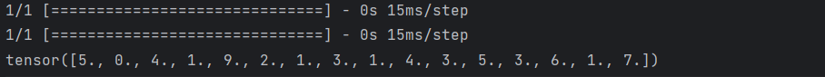

## 初始化：
    def __init__(self):
        self.mnist_load = tf.keras.models.load_model("./mnist_ood")
使用Tensorflow的keras库models方法中load_model功能，加载mnist_ood数据集

## classify：

    def classify(self, imgs : torch.Tensor) -> torch.Tensor:

        len = imgs.shape[0]
        preds = torch.empty(len)

        for i in range(len):

            pre = imgs[i].reshape(1, 28, 28, 1)
            res = self.mnist_load.predict(pre)
            preds[i] = np.argmax(res)

        return preds
将batch值赋给len；

创建preds数组储存n * 1的tensor；

对每一张图片，先修改格式为1 * 28 * 28，再通过self.mnist_load.predict()函数使用优化CNN模型获取各数字与OOD共11个类别各自的预测概率，选取其中概率最大数字或OOD类别为结果赋值给preds数组，最后输出结果。

另，test文件为测试文件，输入一个有16张图像的tensor，得到结果如下：
